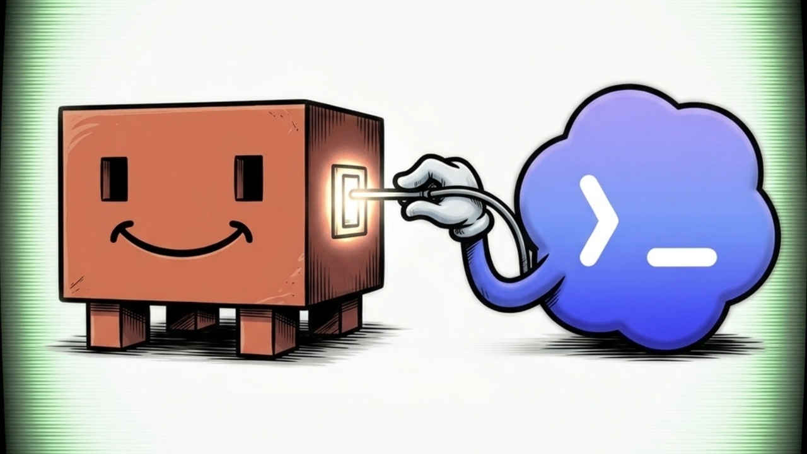

# OpenAI Codex Claude Code Proxy



Run Claude Code with GPT models through
[CLIProxyAPI](https://github.com/router-for-me/CLIProxyAPI).

This project provides two small launchers:

- `./claudex-oai` routes Claude Code to GPT-5.6 Sol through an OpenAI/Codex
  subscription authenticated with OAuth.
- `./claudex` routes Claude Code to GPT-5.6 Sol on Azure OpenAI.

Both launchers enable effort mode, defer tool loading, start the local proxy
automatically, and keep provider credentials out of Claude Code.

## How it works

Claude Code sends requests using Anthropic's Messages API. CLIProxyAPI exposes
an Anthropic-compatible localhost endpoint and translates those requests to the
OpenAI Responses API.

```text
Claude Code -> localhost:8317 -> CLIProxyAPI -> Codex OAuth or Azure OpenAI
```

Azure and OpenAI subscription models use separate names so they cannot route
to the wrong billing source:

- `gpt-5.6-sol` -> OpenAI/Codex OAuth
- `azure-gpt-5.6-sol` -> Azure OpenAI

## Requirements

- macOS or Linux
- [Claude Code](https://docs.anthropic.com/en/docs/claude-code)
- [CLIProxyAPI](https://github.com/router-for-me/CLIProxyAPI)
- Python 3
- One or both of:
  - An OpenAI/Codex subscription supported by CLIProxyAPI OAuth
  - An Azure OpenAI endpoint, API key, and GPT deployment

The automatic background service uses `launchd` on macOS and `nohup` on Linux.

## Install

On macOS:

```bash
brew install cliproxyapi
git clone https://github.com/MikeChongCan/OpenAI-Codex-Claude-Code-Proxy.git
cd OpenAI-Codex-Claude-Code-Proxy
cp .env.example .env
```

Generate a local proxy token:

```bash
openssl rand -hex 32
```

Put that value in `CLIPROXY_LOCAL_TOKEN` inside `.env`. This token protects the
local proxy and must not be the same as a provider API key.

## OpenAI/Codex subscription setup

Render the proxy configuration once, then authenticate CLIProxyAPI with
OpenAI/Codex OAuth:

```bash
./start-cliproxy.sh
```

Stop the foreground process with `Ctrl-C`, then run:

```bash
cliproxyapi -config .runtime/config.yaml -codex-login
```

After completing the browser login, start Claude Code on the official Codex
GPT-5.6 Sol model:

```bash
./claudex-oai
```

Run a single prompt or select another available OAuth model:

```bash
./claudex-oai -p 'Reply with exactly: oauth-ok'
CLAUDEX_OAI_MODEL=gpt-5.5 ./claudex-oai
```

By default, the OAuth launcher keeps Sol as the main model and maps `sonnet`
subagents to GPT-5.6 Terra and `haiku` subagents to GPT-5.6 Luna. It appends the
same delegation policy as the Azure launcher and instructs Claude not to invoke
the bundled `claude-api` skill.

OAuth credentials are stored by CLIProxyAPI in `~/.cli-proxy-api`; they are not
stored in this repository.

## Azure OpenAI setup

Configure these values in `.env`:

```dotenv
AZURE_API_BASE=https://your-resource.services.ai.azure.com/openai/v1
AZURE_API_KEY=your-azure-api-key
CLIPROXY_LOCAL_TOKEN=your-random-local-token

AZURE_OPUS_DEPLOYMENT=gpt-5.6-sol
AZURE_SONNET_DEPLOYMENT=gpt-5.6-terra
AZURE_HAIKU_DEPLOYMENT=gpt-5.6-luna
```

The deployment values are Azure deployment names. Change them when your Azure
resource uses different names.

Start Claude Code on Azure GPT-5.6 Sol:

```bash
./claudex
```

Run a single prompt:

```bash
./claudex -p 'Reply with exactly: azure-ok'
```

Select another Azure tier:

```bash
CLAUDEX_MODEL=azure-gpt-5.6-terra ./claudex
CLAUDEX_MODEL=azure-gpt-5.6-luna ./claudex
```

### Sol main agent with Terra and Luna subagents

`./claudex` starts the main Claude Code conversation on Sol. It maps Claude
Code's model-family aliases as follows:

- `opus` -> `azure-gpt-5.6-sol`
- `sonnet` -> `azure-gpt-5.6-terra`
- `haiku` -> `azure-gpt-5.6-luna`

The launcher intentionally leaves `CLAUDE_CODE_SUBAGENT_MODEL` unset so each
subagent invocation can select its own tier. Ask the Sol parent to use the
`sonnet` model for a Terra worker or the `haiku` model for a Luna worker.
`./claudex` also appends this routing policy to the Claude Code system prompt
automatically and tells the main agent never to invoke the bundled
`claude-api` skill.

Custom subagents can declare a default tier with:

```yaml
model: sonnet # Terra
```

or:

```yaml
model: haiku # Luna
```

Claude Code's per-invocation Agent model has higher precedence than the custom
subagent's `model` field. For deterministic routing, add a project instruction
such as:

```markdown
When delegating implementation or review work, invoke the subagent with model
`sonnet` (Terra). For fast exploration and simple checks, invoke it with model
`haiku` (Luna).
```

Subagents invoked with `model: inherit`, or without any model selection,
inherit the Sol main conversation. Claude Code's built-in Explore, Plan, and
general-purpose agents also inherit the main model unless the parent invokes
them with a specific model.

To force every subagent onto one tier for a session, set the launcher-specific
override. This disables per-subagent Terra/Luna selection for that session:

```bash
CLAUDEX_SUBAGENT_MODEL=sonnet ./claudex # all subagents use Terra
CLAUDEX_SUBAGENT_MODEL=haiku ./claudex  # all subagents use Luna
```

## Commands

```bash
./claudex-oai             # OpenAI/Codex OAuth launcher
./claudex                 # Azure OpenAI launcher
./ensure-cliproxy.sh      # Start the background proxy if needed
./stop-cliproxy.sh        # Stop the managed background proxy
./start-cliproxy.sh       # Run the proxy in the foreground
./doctor.sh               # Test Azure and protocol translation
./cache-doctor.py         # Verify an Azure prompt-cache hit
```

For global commands:

```bash
mkdir -p "$HOME/.local/bin"
ln -s "$PWD/claudex-oai" "$HOME/.local/bin/claudex-oai"
ln -s "$PWD/claudex" "$HOME/.local/bin/claudex"
```

## Model and effort settings

The launchers set:

```text
CLAUDE_CODE_ALWAYS_ENABLE_EFFORT=1
CLAUDE_CODE_MAX_TOOL_USE_CONCURRENCY=3
ENABLE_TOOL_SEARCH=true
```

Deferred tool loading is important when Claude Code has many MCP tools because
Azure rejects requests containing more than 128 tools.

The Azure launcher uses provider-prefixed aliases to prevent a GPT-5.6 request
from accidentally consuming an OpenAI subscription—or the reverse.

## Prompt caching

Azure prompt caching is automatic for supported models. Repeated requests need
an identical prefix of at least 1,024 tokens. CLIProxyAPI maps Azure's
`cached_tokens` usage back to Anthropic's `cache_read_input_tokens` field.

Verify caching with two small, billable requests:

```bash
set -a
source .env
set +a
./cache-doctor.py
```

Expected result:

```text
OK Azure prompt caching is preserved through the proxy
```

## Validation

Run the offline checks:

```bash
python3 -m unittest discover -s tests -v
bash -n ensure-cliproxy.sh stop-cliproxy.sh start-cliproxy.sh \
  claudex claudex-oai doctor.sh
git diff --check
```

Run live smoke tests:

```bash
./doctor.sh
./claudex -p 'Reply with exactly: azure-ok'
./claudex-oai -p 'Reply with exactly: oauth-ok'
```

`doctor.sh` and the launchers make billable provider requests.

## Security

- The proxy listens only on `127.0.0.1`.
- `.env`, generated configuration, logs, OAuth files, and `.runtime` are
  excluded from Git.
- The generated CLIProxyAPI configuration is written with mode `0600`.
- The launchers unset `ANTHROPIC_API_KEY` to prevent accidental direct Anthropic
  billing.
- The launchers never enable `--dangerously-skip-permissions`; pass it yourself
  only when you explicitly accept that risk.
- Do not expose port `8317` to a LAN or the public internet without proper TLS,
  authentication, and network controls.

## Troubleshooting

### Proxy does not start

```bash
./stop-cliproxy.sh
./start-cliproxy.sh
```

Keep the foreground process open and run `./doctor.sh` in another terminal.

### `claude.ai connectors are disabled`

Expected. Claude Code sees a custom API credential and disables Claude.ai
connectors. Local MCP tools continue to work.

### Too many tools

Keep `ENABLE_TOOL_SEARCH=true`. Setting it to `false` can make Claude Code send
every installed MCP tool in one request and exceed the provider limit.

### Encrypted reasoning content cannot be verified

Start a new Claude Code session after switching provider, deployment, model, or
effort level. Encrypted reasoning state belongs to the Responses API route that
created it and cannot safely move between Azure and OpenAI OAuth routes.

## Documentation

- [Chinese runbook](SOP.zh-CN.md)
- [English launch post](POST.en.md)
- [Traditional Chinese launch post](POST.zh-TW.md)

## Acknowledgements

Built on [CLIProxyAPI](https://github.com/router-for-me/CLIProxyAPI). The
`claudex` workflow was inspired by Theo's public walkthrough.
